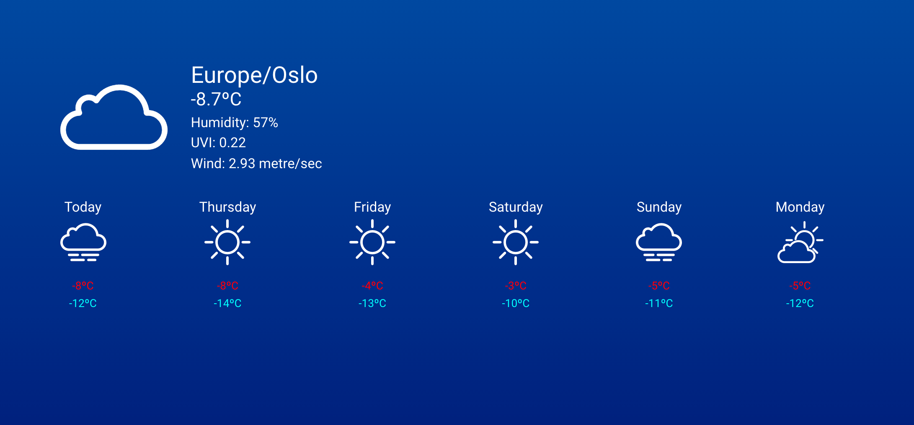

# WeatherForecast App

### Step 1: Install dependencies:

`yarn` or `npm install`

### Step 2 (optional, I've added an free API key for testing):

edit `.env.example to .env` file and add OpenWeather API key

### Step 3: to run project in development mode

`yarn serve` or `npm serve`

### Other Scripts:

- `yarn test:unit` or `npm run test:unit` for testing

- `yarn build` or `npm run build` for `Production Build`
